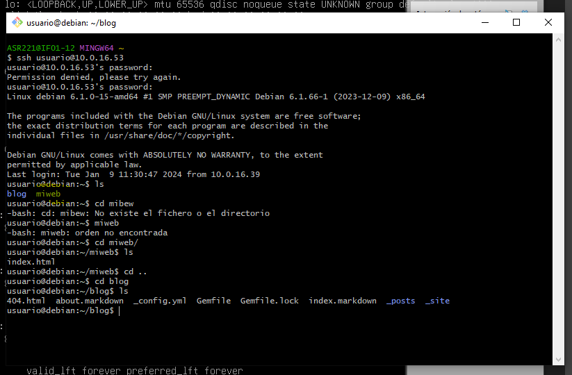
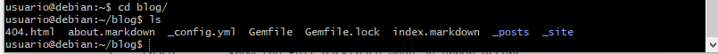
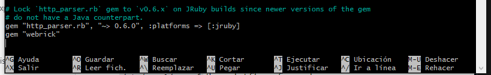
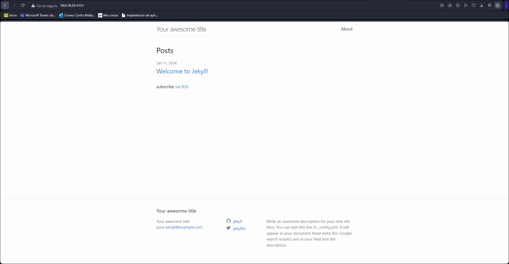

# **Actividad 1.2**: Crear un sitio local en Jekyll con ___Dockers___


#### Carlos Mallavia Belmonte


## Opción 1:

(Documento hecho a posterior de los comandos.)

Primero tendremos que crear un nuevo blog usando el comando:
```
docker run -it --rm -v "$PWD:/srv/jekyll" jekyll/jekyll jekyll new blog
```

Una vez hecho esto se nos creara la carpeta blog y dentro de ella estara todo lo de la configuracion de jekyll:


Ya tenemos los archivos necearios para que la pagina funcione pero no queda instalar una gema. Al usar los comandos no se descarga la gema "webrick". A si entramos en la carpeta blog editamos el archivo Gemfile y añadimos al final:
```
gem "webrick"
```


Ahora ya contamos con todo lo necesario, introducimos el comando:
```
docker run -it --rm -p 4000:4000 -v "$PWD:/srv/jekyll" jekyll/jekyll jekyll serve --force_polling
```
Despues de introducir el comando, esperamos unos segundo a que se lance la pagina y en el buscador ponemos:
```
http://10.0.16.53:4000
```
Y quedaria tal que asi:

Si queremos añadir algun post a la pagina desde el bash editamos el archivo dentro de la capeta _posts.
